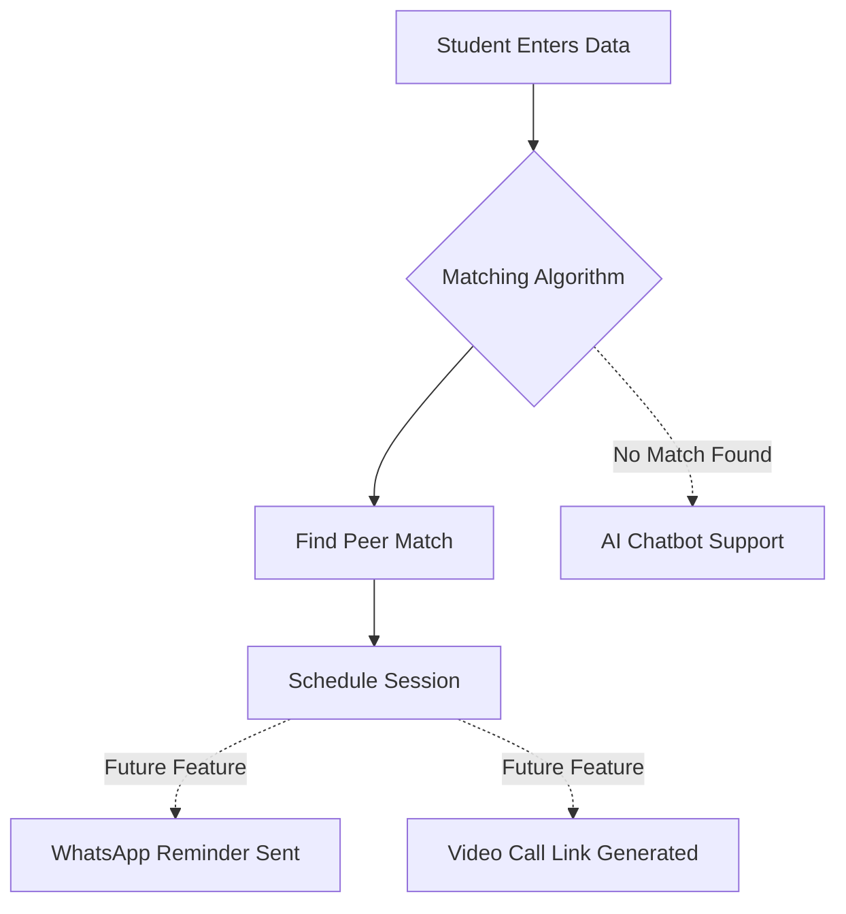

# 🤝 Sahay: Peer Learning Matchmaking System
### **Team: The Semicolon**

**Sahay** is an adaptive learning platform designed to bridge the educational gap for NGO students by intelligently pairing peer mentors and mentees based on subject strengths and weaknesses.

---

## 🧐 The Problem
NGO students face several critical challenges in their learning journey:
* **High Student-Teacher Ratio:** Many NGOs operate with an average ratio of 1:40, making personalized support nearly impossible.
* **Widening Learning Gaps:** Because students learn at different speeds, traditional methods often leave many behind.
* **Low Digital Literacy:** Approximately 60-80% of rural students struggle with digital tools.

## 💡 The Solution
Our platform enables structured **Peer-to-Peer learning**:
* **Skill Profiling:** We capture what a student is "Good At" and what they "Need Help" with.
* **Rule-Based Matching:** A Python algorithm finds the best mentor-mentee combination.
* **Gamified Motivation:** Mentors earn reward points, badges, and credits for successful sessions.

## ⚙️ How It Works (Solution Flow)


1. **Role Setup:** Users select their role (Student/Teacher) and enter their academic year.

2. **Skill Input:** Students detail their subject strengths and weaknesses.

3. **Profile Analysis:** The system converts entries into structured learner profiles.
   
4. **Watching Logic:** The Python backend compares data to find the best pairs using compatibility scores.

5. **Dashboard Display:** Recommended pairs appear on the Streamlit UI for review.

6. **Reward System:** Mentors receive XP points and badges upon session completion.


## 🚀 Future Scope

Our roadmap to scale this project includes:

* **🤖 AI Tutor Chatbot:** 24/7 AI-powered support when a human mentor is unavailable.
* **📲 WhatsApp Integration:** Automated session reminders and progress reports sent via WhatsApp.
* **📹 Built-in Video Call:** Secure, remote peer-learning rooms for remote students.
* **🎙️ Voice-Enabled Input:** Helping younger students navigate the app easily.


## 🛠️ Tech Stack

* **Frontend:** Streamlit 
* **Language:** Python 
* **Version Control:** GitHub 
---
## 💻 How to Run Locally

Follow these steps to set up the **Sahay** prototype on your computer:

1. **Clone the repository:**

```bash
git clone [Paste Your Repo Link Here]

```

2. **Install dependencies:**

```bash
pip install streamlit

```

3. **Run the application:**

```bash
streamlit run app.py

```

4. **Access the App:** Open your browser and go to `http://localhost:8501`.

---

## 👥 Team: The Semicolon

* **Srushti Kalokhe** 
* **Swarali Warade** 
* **Nikita Sharma** 
* **Tanieeshka Sonawane** 
* **Anushka Dhane** 

